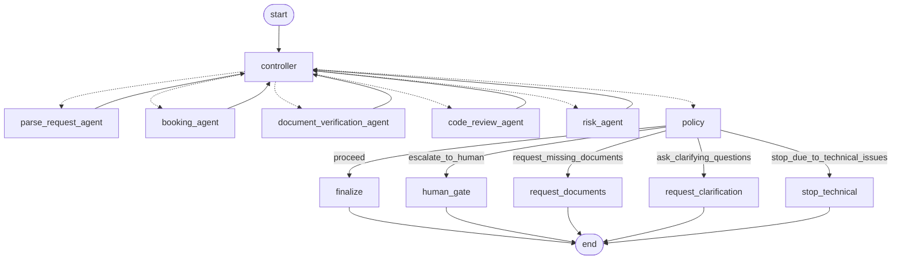

# Booking – Blackboard Multi-Agent Pattern

A hotel-booking system built with [LangGraph](https://github.com/langchain-ai/langgraph) that demonstrates the **Blackboard architecture pattern**. Independent agents never call each other; they only read from and write to a shared state - the _blackboard_ (`BookingState`). A **controller** repeatedly picks the next eligible agent, and a **policy** makes the final routing decision.

## How it works

1. The **controller** loops, running the first agent whose precondition matches the current blackboard state (guarded by `max_iterations`).
2. Each **agent** posts its partial result and an audit entry back to the blackboard.
3. Once no agent is eligible, the **policy** inspects the state and routes to one terminal outcome.

## Agents (knowledge sources)

| Agent                         | Role                                                    |
| ----------------------------- | ------------------------------------------------------- |
| `parse_request_agent`         | Extracts structured booking fields from the raw request |
| `booking_agent`               | Finds candidate hotels matching budget/preferences      |
| `document_verification_agent` | Checks required customer documents                      |
| `code_review_agent`           | Technical/sanity checks before booking                  |
| `risk_agent`                  | Aggregates a risk score from what other agents posted   |

## Policy outcomes

`proceed → finalize`, `escalate_to_human` (human approval gate), `request_missing_documents`, `ask_clarifying_questions`, `stop_due_to_technical_issues`.

## Graph



## Running

```bash
uv run app
```

Pick a scenario from the menu (happy path, missing phone, or low risk tolerance that escalates to a human).

The final state of each run is saved to `src/outputs/run_output.json`.

To open the live graph in a browser:

```bash
uv run python src/visualize_graph.py
```
